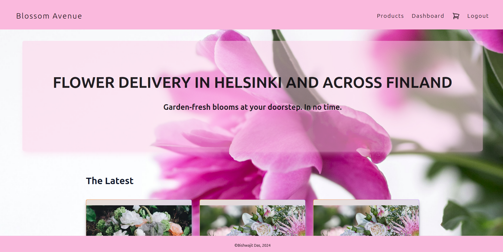
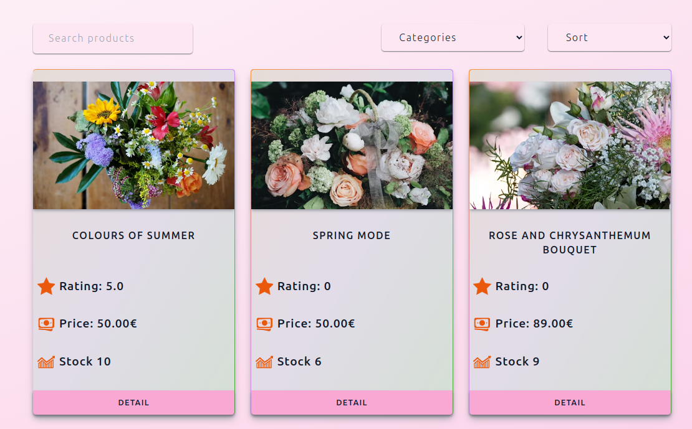
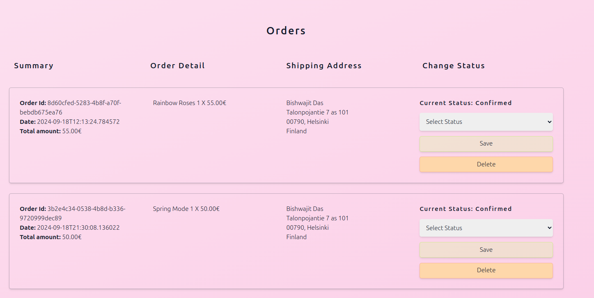
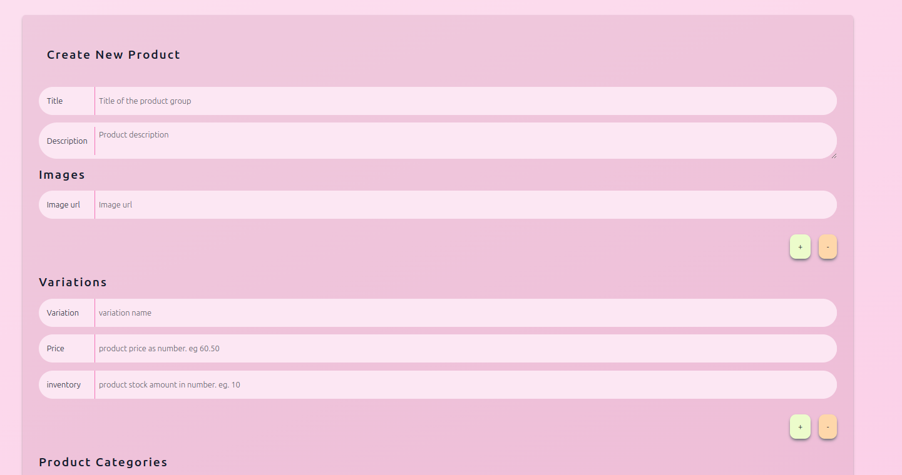

# Blossom Avenue

## Overview

This project is the Front service for Blossom Avenue which is a flower shop application, developed using React, Typescript, React-Query and Tailwindcss. This user interface various functionalities including user management, product management, and order processing. The system supports three types of users: **Admin**, **Employee** and **Customer**.

### Live Demo

The project is deployed you can visit in the following link.

- There are some test user credentials are given at the login page for testing
- There are some test users to test user update and delete.
- This is still an ongoing project some feature might not work as intended or missing.

[Blossom Avenue](https://blossomavenue.vercel.app/)

The backend project is deployed too. You can find the API documentation from the following link.

[The Swagger documentation](https://blossomavenue-f2grfmdmepbcb4es.northeurope-01.azurewebsites.net/index.html)

### Key Features

- **User Management**:

  - User can create and update their profile.
  - Admin user can update other users
    - Change user role and active status.
    - Delete user.

- **Authentication Management**

  - Users can authenticate with their credentials
  - When users logged in, a jwt access token is send as response and a HttpOnly refresh token is set to user's browser.
  - Users can access resources from Authorized routes with valid access token
  - When access token is expired, they can make a request to /refreshToken endpoint with expired access token and refresh token from cookie
    - expired access token is required to generate new access token and refresh token.
  - Users can logged from all the session by making a request to /logout route with access and refresh token.

- **Product & Category Management**:

  - Customers can browse sort, filter products.
  - And can also view product detail
  - Admins and Employees can create, view, update, delete
    - Product Categories
    - Products
    - Images
    - Variations
      - Each product can have multiple variation and images.

- **Cart Management**
  - Customers can add and remove product to their car as well as can increase and decrease the amount by one at a time.
  - Customers can clear their cart altogether.
  - Cart info is stored in database, so customer can still view their cart from another session.
- **Order Management**

  - Customer can place order, view all of their orders and order by id.
  - Admin or Employee can update or delete order
    - Such as change status, shipping address.

- **Product Reviews**:
  - Customers can create, update, delete, and view reviews for products.

### Technologies Used

- **React**
- **Typescript**
- **React Query**
- **Tailwindcss**
